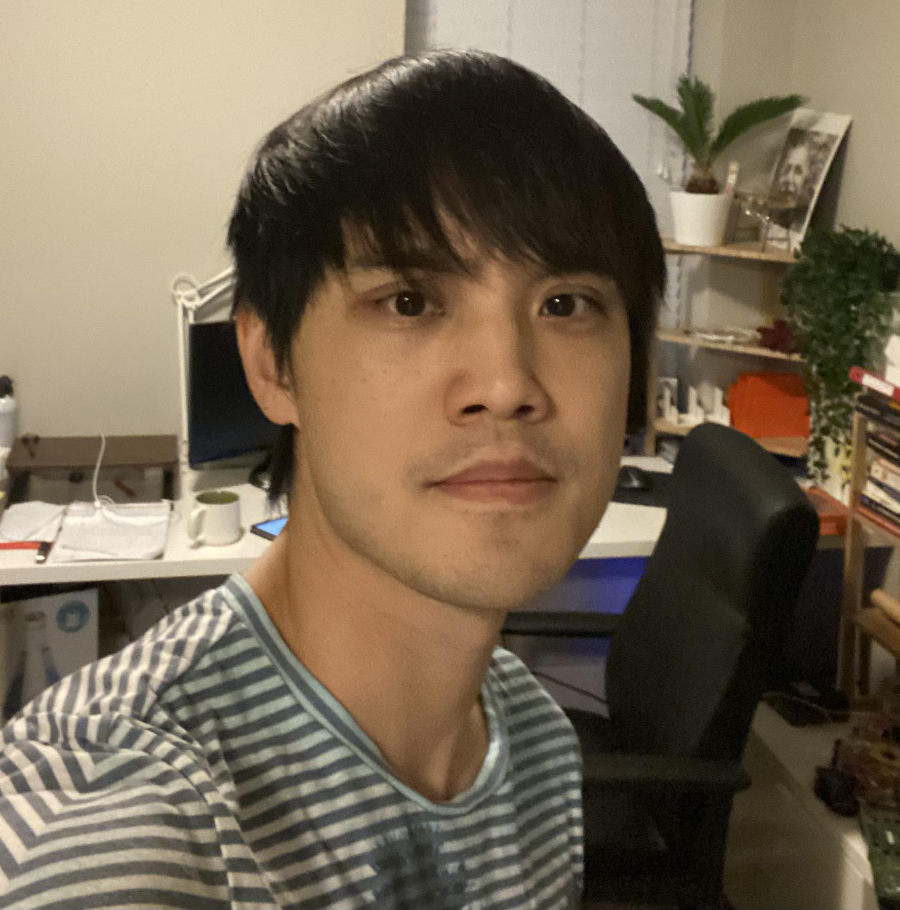

@def title = "schu - About"
@def tags = ["syntax", "code"]

@@img-me  @@

I am a post-doctoral research scientist at Columbia University, collaborating with [Chaolin Zhang](https://systemsbiology.columbia.edu/faculty/chaolin-zhang) and other wonderful members in the [Zhang Lab](https://zhanglab.c2b2.columbia.edu/). Previously, I earned my Ph.D. in computer science at Washington University in St. Louis under the mentorship of [Gary Stormo](https://en.wikipedia.org/wiki/Gary_Stormo). My current research focuses on deep learning interpretaions, and developing computational methods for analyzing (1) protein-DNA/RNA interactions and (2) high-throughput functional genomics/proteomics screenings.

A central theme in my research is to consider what representation is suited for DNA sequences that give the most helpful information. Traditionally, there are k-mers, position-weight-matrices, parametric statistical models like HMMs, and more recently, deep neural networks. I am particularly interested in sparse representations, a rich framework that allows us to build techniques to answer challenging inferential questions in regulatory genomics.

For example, in regulatory genomics, we want to infer the following:

- The DNA sequences' regulatory elements, e.g., the motifs.
- The key regulatory elements in the DNA sequences give rise to the observed phenomenon.
- The counterfactuals, e.g., a minimal change to a DNA sequence that turns off the observed effects.

We can obtain a sparse representation of DNA sequences using principled deep learning techniques, e.g., deep unfolding. We use [sparse representations to reveal many more hidden motifs not shown on the JASPAR database](https://academic.oup.com/bioinformatics/advance-article/doi/10.1093/bioinformatics/btad378/7192989?utm_source=advanceaccess&utm_campaign=bioinformatics&utm_medium=email). Our result shows that sparse representation is a scalable and interpretable approach to biological sequence problems.

---

My name in Mandarin is Kuei-Hsien Chu (朱桂賢). Hsien pronounced like Shane, and that's how I got Shane. I grew up in Taiwan and have been living in the US since 2008.

<!-- 

@@clear @@
@@img-me-small  @@

I am a post-doctoral research scientist at Columbia University, collaborating with [Chaolin Zhang](https://systemsbiology.columbia.edu/faculty/chaolin-zhang) in the [Zhang Lab](https://zhanglab.c2b2.columbia.edu/). I earned my Ph.D. in computer science at Washington University in St. Louis under [Gary Stormo](https://en.wikipedia.org/wiki/Gary_Stormo). My current research focuses on deep learning interpretations, demonstrated through applications involving high-throughput functional genomics/proteomics screenings.

@@spacing @@

Most applications in genomics and proteomics involve *sequence-to-label* problems, such as:

~~~
<figure style="float: right; margin-right: 6px; width: 327px; margin-left: 5px;  border: 1px solid black"">
  
  <figcaption style="font-style: italic; color: gray; text-align: center; margin-top: 1px;">Which patterns matter?</figcaption>
</figure>
~~~

@@small-list
- Predicting mutation effects on biological functions
- Locating genetic switches and control regions
- Mapping protein-DNA/RNA binding sites
- Other genomic tasks (splicing, gene expression)
@@

@@spacing @@

The fundamental question is: which *patterns* drive the outcome? My [doctoral work](https://openscholarship.wustl.edu/cgi/viewcontent.cgi?article=2066&context=eng_etds) tackled this challenge by developing methods to uncover patterns from deep learning models and quantify their governing rules. My subsequent work has revealed broader interpretability principles for scientific data, particularly when learned features are neither edge detectors nor word embeddings.

<!-- 
For example, in regulatory genomics, we want to infer the following:

- The DNA sequences' regulatory elements, e.g., the motifs.
- The key regulatory elements in the DNA sequences give rise to the observed phenomenon.
- The counterfactuals, e.g., a minimal change to a DNA sequence that turns off the observed effects. -->
<!-- 
We can obtain a sparse representation of DNA sequences using principled deep learning techniques, e.g., deep unfolding. We use [sparse representations to reveal many more hidden motifs not shown on the JASPAR database](https://academic.oup.com/bioinformatics/advance-article/doi/10.1093/bioinformatics/btad378/7192989?utm_source=advanceaccess&utm_campaign=bioinformatics&utm_medium=email). Our result shows that sparse representation is a scalable and interpretable approach to biological sequence problems. -->

